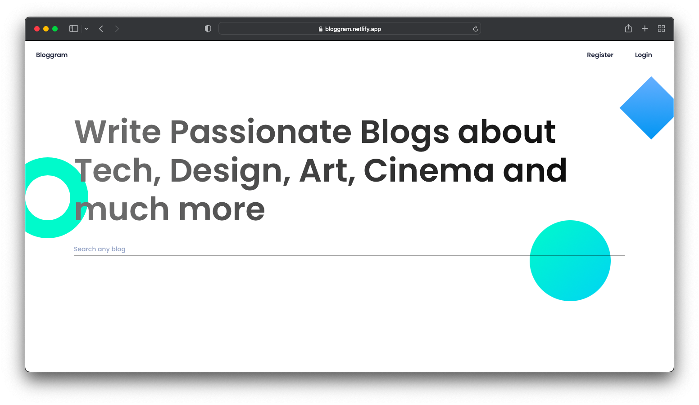
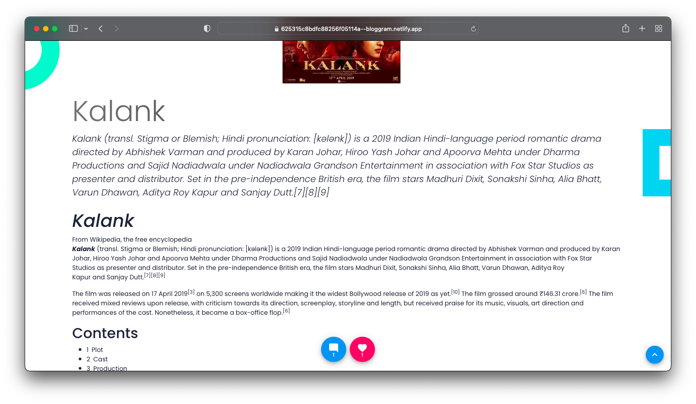
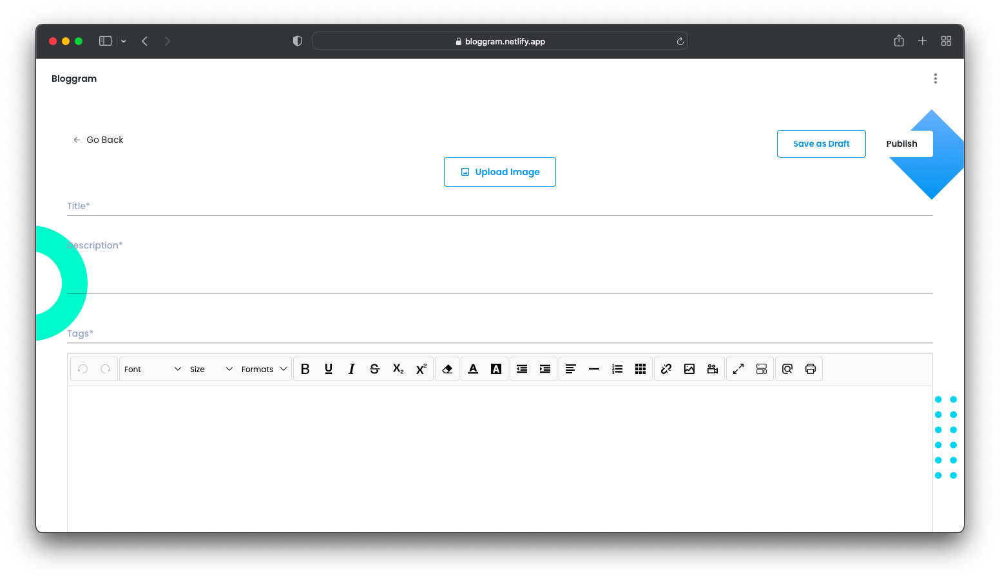

  

  

## Demo Pages

## Demo Account

- email - `kane.mckenzie65@ethereal.email`

- password - `aab8zKVKPU4yM8NC2K`

## Deployment Link

https://bloggram-beta.vercel.app/

## Backend Deployment Link

https://long-cyan-spider-tux.cyclic.app/

## Backend

https://github.com/shelcia/blog-backend

### To work with this repo

- Clone this repo

- Run <code>npm install</code>

- Then Run <code>npm start</code>
